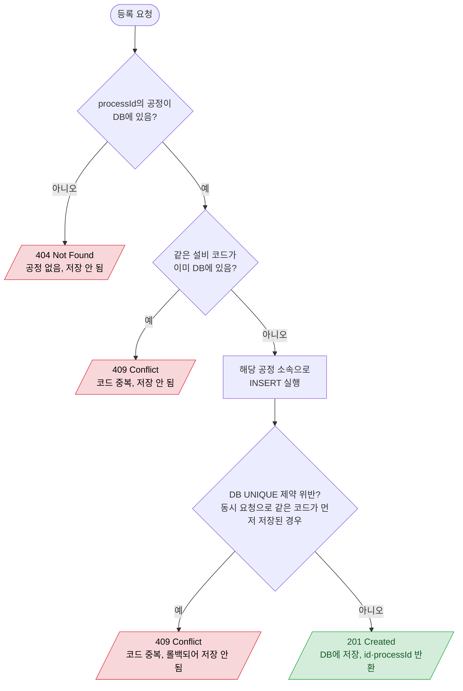
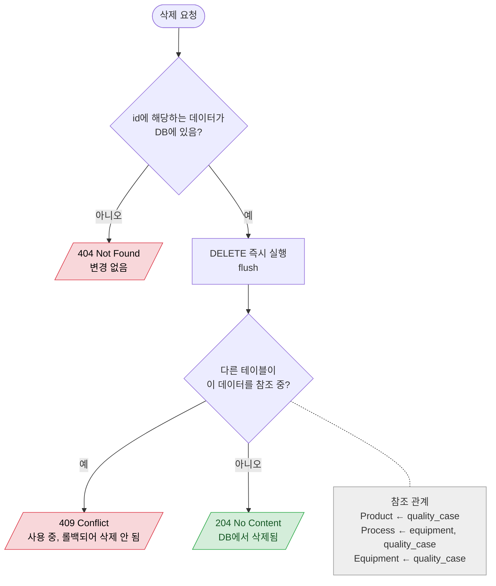

# 순서도 템플릿

## 색 규칙

| class | 의미 | 사용처 |
|---|---|---|
| `ok` (초록) | 성공 | 201, 200, 204 |
| `fail` (연한 빨강, **검은 글자**) | 의도된 실패 | 404, 409, 비즈니스 규칙 위반 |
| `bug` (노랑) | 코드가 처리하지 못하는 경로 | 잡히지 않은 예외로 500 |
| `note` (회색) | 참고 메모 | FK 참조 관계 등 |

`bug`가 필요할 때 정의: `classDef bug fill:#fff3cd,stroke:#ffc107,color:#856404`

## 등록 예시 (부모 확인 + 중복 검사)

````markdown
# Equipment 등록

`POST /api/processes/{processId}/equipments`


````

## 삭제 예시 (FK 참조 → 409)

````markdown
# 삭제 (Product / Process / Equipment 공통)

`DELETE /api/products/{id}`, `DELETE /api/processes/{id}`, `DELETE /api/equipments/{id}`


````

## 표기 규칙

- 시작: `A([... 요청])` (둥근 칸)
- 조건: `{...?}` 질문형, 줄바꿈은 `<br/>`
- 처리 단계: `[...]` — 결과를 가르는 DB 동작(INSERT, DELETE+flush)만. 내부 변환 같은 사소한 단계는 생략
- 결과: `[/상태코드 이름<br/>DB 변화/]` (평행사변형)
- 화살표 라벨: `-- 예 -->`, `-- 아니오 -->`
