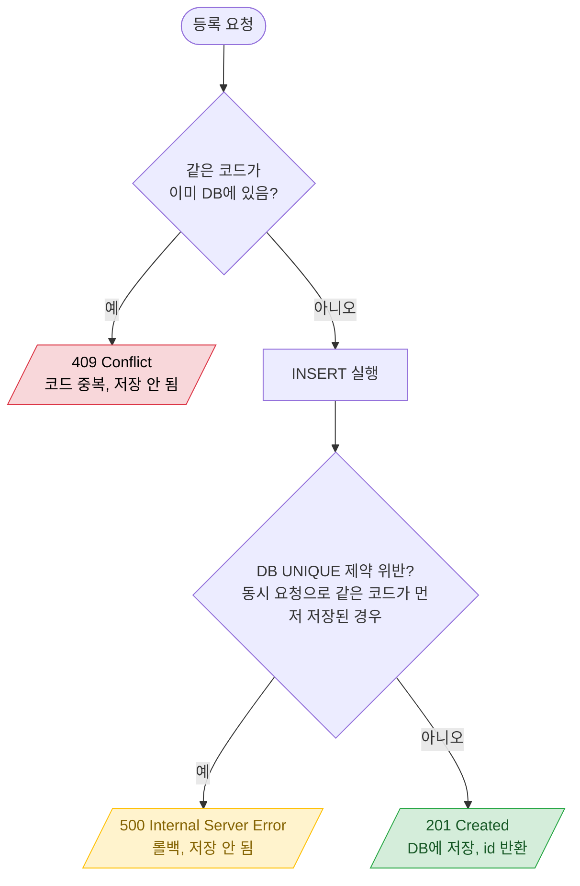

# Product / Process 등록

`POST /api/products`, `POST /api/processes`

```mermaid
flowchart TD
    A([등록 요청]) --> C{같은 코드가<br/>이미 DB에 있음?}
    C -- 예 --> R409[/409 Conflict<br/>코드 중복, 저장 안 됨/]
    C -- 아니오 --> D[INSERT 실행]
    D --> E{DB UNIQUE 제약 위반?<br/>동시 요청으로 같은 코드가 먼저 저장된 경우}
    E -- 예 --> R500[/500 Internal Server Error<br/>롤백, 저장 안 됨/]
    E -- 아니오 --> R201[/201 Created<br/>DB에 저장, id 반환/]

    classDef ok fill:#d4edda,stroke:#28a745,color:#155724
    classDef fail fill:#f8d7da,stroke:#dc3545,color:#000000
    classDef bug fill:#fff3cd,stroke:#ffc107,color:#856404
    class R201 ok
    class R409 fail
    class R500 bug
```

노란 칸은 처리되지 않은 경로입니다. 409가 맞지만 현재는 500이 반환됩니다.
