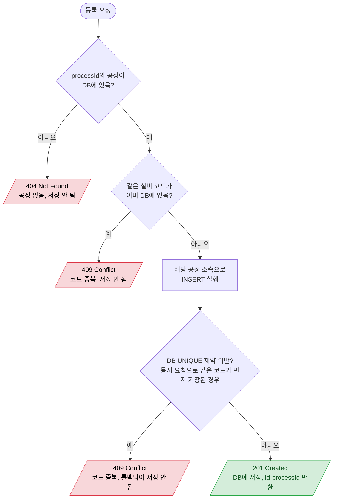

# Equipment 등록

`POST /api/processes/{processId}/equipments`

```mermaid
flowchart TD
    A([등록 요청]) --> C{processId의 공정이<br/>DB에 있음?}
    C -- 아니오 --> R404[/404 Not Found<br/>공정 없음, 저장 안 됨/]
    C -- 예 --> D{같은 설비 코드가<br/>이미 DB에 있음?}
    D -- 예 --> R409[/409 Conflict<br/>코드 중복, 저장 안 됨/]
    D -- 아니오 --> E[해당 공정 소속으로<br/>INSERT 실행]
    E --> F{DB UNIQUE 제약 위반?<br/>동시 요청으로 같은 코드가 먼저 저장된 경우}
    F -- 예 --> R409B[/409 Conflict<br/>코드 중복, 롤백되어 저장 안 됨/]
    F -- 아니오 --> R201[/201 Created<br/>DB에 저장, id·processId 반환/]

    classDef ok fill:#d4edda,stroke:#28a745,color:#155724
    classDef fail fill:#f8d7da,stroke:#dc3545,color:#000000
    class R201 ok
    class R404,R409,R409B fail
```
