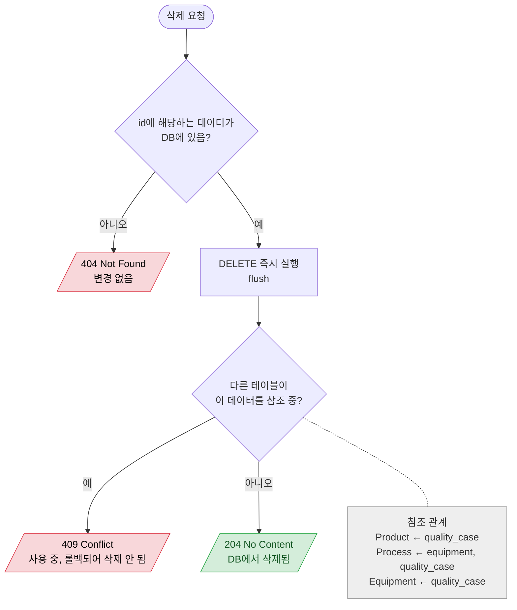

# 삭제 (Product / Process / Equipment 공통)

`DELETE /api/products/{id}`, `DELETE /api/processes/{id}`, `DELETE /api/equipments/{id}`

```mermaid
flowchart TD
    A([삭제 요청]) --> B{id에 해당하는 데이터가<br/>DB에 있음?}
    B -- 아니오 --> R404[/404 Not Found<br/>변경 없음/]
    B -- 예 --> C[DELETE 즉시 실행<br/>flush]
    C --> D{다른 테이블이<br/>이 데이터를 참조 중?}
    D -- 예 --> R409[/409 Conflict<br/>사용 중, 롤백되어 삭제 안 됨/]
    D -- 아니오 --> R204[/204 No Content<br/>DB에서 삭제됨/]

    D -.- N[참조 관계<br/>Product ← quality_case<br/>Process ← equipment, quality_case<br/>Equipment ← quality_case]

    classDef ok fill:#d4edda,stroke:#28a745,color:#155724
    classDef fail fill:#f8d7da,stroke:#dc3545,color:#000000
    classDef note fill:#eeeeee,stroke:#999999,color:#333333
    class R204 ok
    class R404,R409 fail
    class N note
```
