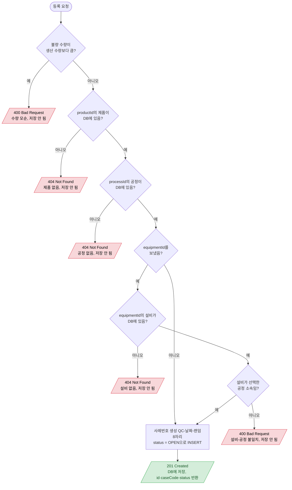

# QualityCase 등록

`POST /api/quality-cases`

```mermaid
flowchart TD
    A([등록 요청]) --> B{불량 수량이<br/>생산 수량보다 큼?}
    B -- 예 --> R400Q[/400 Bad Request<br/>수량 모순, 저장 안 됨/]
    B -- 아니오 --> C{productId의 제품이<br/>DB에 있음?}
    C -- 아니오 --> R404P[/404 Not Found<br/>제품 없음, 저장 안 됨/]
    C -- 예 --> D{processId의 공정이<br/>DB에 있음?}
    D -- 아니오 --> R404R[/404 Not Found<br/>공정 없음, 저장 안 됨/]
    D -- 예 --> E{equipmentId를<br/>보냈음?}
    E -- 아니오 --> G
    E -- 예 --> F{equipmentId의 설비가<br/>DB에 있음?}
    F -- 아니오 --> R404E[/404 Not Found<br/>설비 없음, 저장 안 됨/]
    F -- 예 --> F2{설비가 선택한<br/>공정 소속임?}
    F2 -- 아니오 --> R400M[/400 Bad Request<br/>설비-공정 불일치, 저장 안 됨/]
    F2 -- 예 --> G[사례번호 생성 QC-날짜-랜덤8자리<br/>status = OPEN으로 INSERT]
    G --> R201[/201 Created<br/>DB에 저장, id·caseCode·status 반환/]

    classDef ok fill:#d4edda,stroke:#28a745,color:#155724
    classDef fail fill:#f8d7da,stroke:#dc3545,color:#000000
    class R201 ok
    class R400Q,R404P,R404R,R404E,R400M fail
```

사례번호는 순번이 아닌 랜덤값이라 동시 등록에도 중복 검사가 필요 없습니다.
