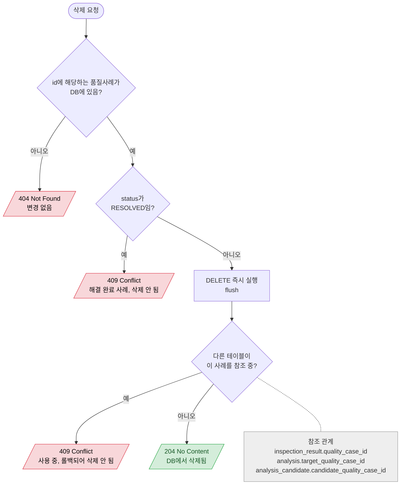

# QualityCase 삭제

`DELETE /api/quality-cases/{id}`

```mermaid
flowchart TD
    A([삭제 요청]) --> B{id에 해당하는 품질사례가<br/>DB에 있음?}
    B -- 아니오 --> R404[/404 Not Found<br/>변경 없음/]
    B -- 예 --> C{status가<br/>RESOLVED임?}
    C -- 예 --> R409R[/409 Conflict<br/>해결 완료 사례, 삭제 안 됨/]
    C -- 아니오 --> D[DELETE 즉시 실행<br/>flush]
    D --> E{다른 테이블이<br/>이 사례를 참조 중?}
    E -- 예 --> R409U[/409 Conflict<br/>사용 중, 롤백되어 삭제 안 됨/]
    E -- 아니오 --> R204[/204 No Content<br/>DB에서 삭제됨/]

    E -.- N[참조 관계<br/>inspection_result.quality_case_id<br/>analysis.target_quality_case_id<br/>analysis_candidate.candidate_quality_case_id]

    classDef ok fill:#d4edda,stroke:#28a745,color:#155724
    classDef fail fill:#f8d7da,stroke:#dc3545,color:#000000
    classDef note fill:#eeeeee,stroke:#999999,color:#333333
    class R204 ok
    class R404,R409R,R409U fail
    class N note
```
