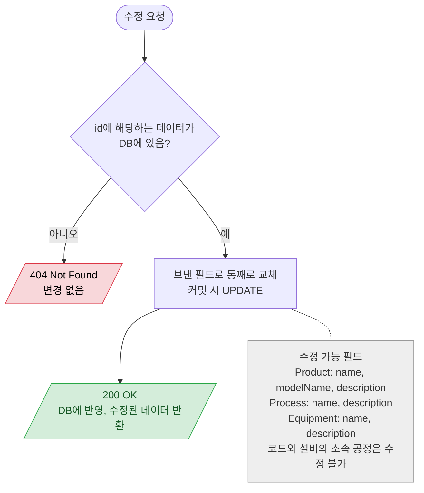

# 수정 (Product / Process / Equipment 공통)

`PATCH /api/products/{id}`, `PATCH /api/processes/{id}`, `PATCH /api/equipments/{id}`

```mermaid
flowchart TD
    A([수정 요청]) --> B{id에 해당하는 데이터가<br/>DB에 있음?}
    B -- 아니오 --> R404[/404 Not Found<br/>변경 없음/]
    B -- 예 --> C[보낸 필드로 통째로 교체<br/>커밋 시 UPDATE]
    C --> R200[/200 OK<br/>DB에 반영, 수정된 데이터 반환/]

    C -.- N[수정 가능 필드<br/>Product: name, modelName, description<br/>Process: name, description<br/>Equipment: name, description<br/>코드와 설비의 소속 공정은 수정 불가]

    classDef ok fill:#d4edda,stroke:#28a745,color:#155724
    classDef fail fill:#f8d7da,stroke:#dc3545,color:#000000
    classDef note fill:#eeeeee,stroke:#999999,color:#333333
    class R200 ok
    class R404 fail
    class N note
```

보내지 않은 nullable 필드(`modelName`, `description`)는 null로 비워집니다.
