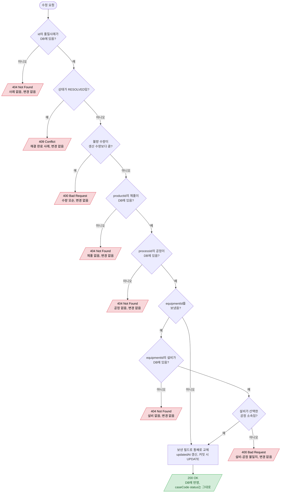

# QualityCase 수정

`PATCH /api/quality-cases/{id}`

```mermaid
flowchart TD
    A([수정 요청]) --> A1{id의 품질사례가<br/>DB에 있음?}
    A1 -- 아니오 --> R404C[/404 Not Found<br/>사례 없음, 변경 없음/]
    A1 -- 예 --> A2{상태가 RESOLVED임?}
    A2 -- 예 --> R409[/409 Conflict<br/>해결 완료 사례, 변경 없음/]
    A2 -- 아니오 --> B{불량 수량이<br/>생산 수량보다 큼?}
    B -- 예 --> R400Q[/400 Bad Request<br/>수량 모순, 변경 없음/]
    B -- 아니오 --> C{productId의 제품이<br/>DB에 있음?}
    C -- 아니오 --> R404P[/404 Not Found<br/>제품 없음, 변경 없음/]
    C -- 예 --> D{processId의 공정이<br/>DB에 있음?}
    D -- 아니오 --> R404R[/404 Not Found<br/>공정 없음, 변경 없음/]
    D -- 예 --> E{equipmentId를<br/>보냈음?}
    E -- 아니오 --> G
    E -- 예 --> F{equipmentId의 설비가<br/>DB에 있음?}
    F -- 아니오 --> R404E[/404 Not Found<br/>설비 없음, 변경 없음/]
    F -- 예 --> F2{설비가 선택한<br/>공정 소속임?}
    F2 -- 아니오 --> R400M[/400 Bad Request<br/>설비-공정 불일치, 변경 없음/]
    F2 -- 예 --> G[보낸 필드로 통째로 교체<br/>updatedAt 갱신, 커밋 시 UPDATE]
    G --> R200[/200 OK<br/>DB에 반영, caseCode·status는 그대로/]

    classDef ok fill:#d4edda,stroke:#28a745,color:#155724
    classDef fail fill:#f8d7da,stroke:#dc3545,color:#000000
    class R200 ok
    class R404C,R409,R400Q,R404P,R404R,R404E,R400M fail
```

`equipmentId`를 null로 보내면 설비 연결이 해제됩니다. `rootCause/correctiveAction/resultSummary`는 이 API로 바꿀 수 없고, 추후 `/resolve`에서만 채웁니다.
