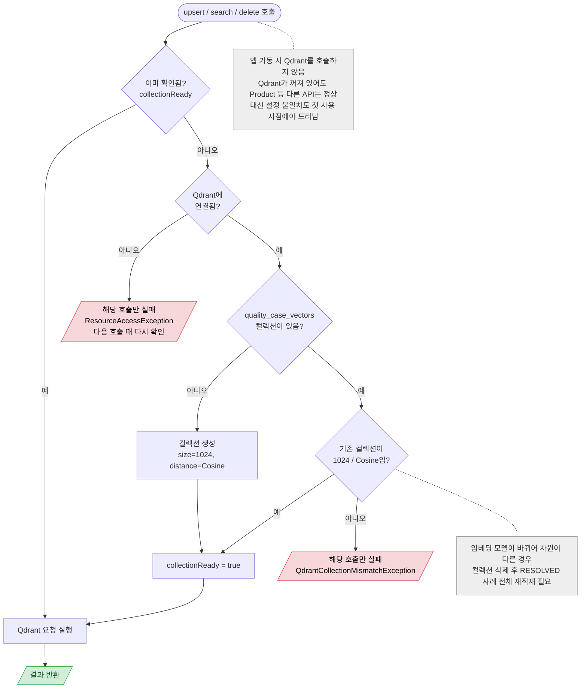

# Qdrant 컬렉션 확인 (첫 사용 시)

`QdrantClient.upsert / search / delete` → `ensureReady()` → `ensureCollection()` (API 아님, 성공할 때까지 Qdrant 첫 호출마다 확인)

```mermaid
flowchart TD
    A([upsert / search / delete 호출]) --> R{이미 확인됨?<br/>collectionReady}
    R -- 예 --> CALL[Qdrant 요청 실행]
    R -- 아니오 --> B{Qdrant에<br/>연결됨?}
    B -- 아니오 --> RDOWN[/해당 호출만 실패<br/>ResourceAccessException<br/>다음 호출 때 다시 확인/]
    B -- 예 --> C{quality_case_vectors<br/>컬렉션이 있음?}
    C -- 아니오 --> D[컬렉션 생성<br/>size=1024, distance=Cosine]
    D --> SET[collectionReady = true]
    C -- 예 --> E{기존 컬렉션이<br/>1024 / Cosine임?}
    E -- 예 --> SET
    E -- 아니오 --> RMIS[/해당 호출만 실패<br/>QdrantCollectionMismatchException/]
    SET --> CALL
    CALL --> ROK[/결과 반환/]

    A -.- N1[앱 기동 시 Qdrant를 호출하지 않음<br/>Qdrant가 꺼져 있어도 Product 등 다른 API는 정상<br/>대신 설정 불일치도 첫 사용 시점에야 드러남]
    E -.- N2[임베딩 모델이 바뀌어 차원이 다른 경우<br/>컬렉션 삭제 후 RESOLVED 사례 전체 재적재 필요]

    classDef ok fill:#d4edda,stroke:#28a745,color:#155724
    classDef fail fill:#f8d7da,stroke:#dc3545,color:#000000
    classDef note fill:#eeeeee,stroke:#999999,color:#333333
    class ROK ok
    class RDOWN,RMIS fail
    class N1,N2 note
```
