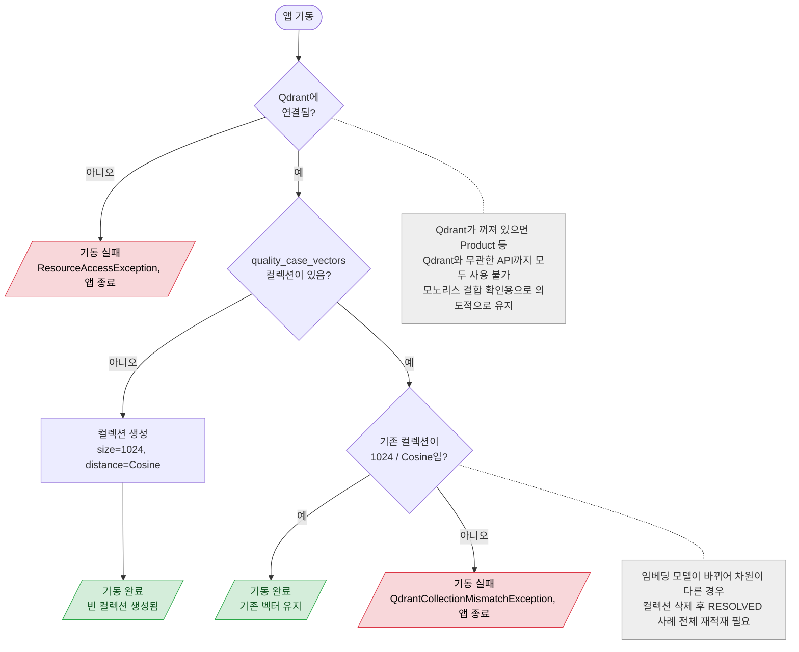

# Qdrant 컬렉션 확인 (기동 시)

`QdrantCollectionInitializer` → `QdrantClient.ensureCollection()` (API 아님, 앱 기동 직후 1회)

```mermaid
flowchart TD
    A([앱 기동]) --> B{Qdrant에<br/>연결됨?}
    B -- 아니오 --> RDOWN[/기동 실패<br/>ResourceAccessException, 앱 종료/]
    B -- 예 --> C{quality_case_vectors<br/>컬렉션이 있음?}
    C -- 아니오 --> D[컬렉션 생성<br/>size=1024, distance=Cosine]
    D --> ROK1[/기동 완료<br/>빈 컬렉션 생성됨/]
    C -- 예 --> E{기존 컬렉션이<br/>1024 / Cosine임?}
    E -- 예 --> ROK2[/기동 완료<br/>기존 벡터 유지/]
    E -- 아니오 --> RMIS[/기동 실패<br/>QdrantCollectionMismatchException, 앱 종료/]

    B -.- N1[Qdrant가 꺼져 있으면 Product 등<br/>Qdrant와 무관한 API까지 모두 사용 불가<br/>모노리스 결합 확인용으로 의도적으로 유지]
    E -.- N2[임베딩 모델이 바뀌어 차원이 다른 경우<br/>컬렉션 삭제 후 RESOLVED 사례 전체 재적재 필요]

    classDef ok fill:#d4edda,stroke:#28a745,color:#155724
    classDef fail fill:#f8d7da,stroke:#dc3545,color:#000000
    classDef note fill:#eeeeee,stroke:#999999,color:#333333
    class ROK1,ROK2 ok
    class RDOWN,RMIS fail
    class N1,N2 note
```
