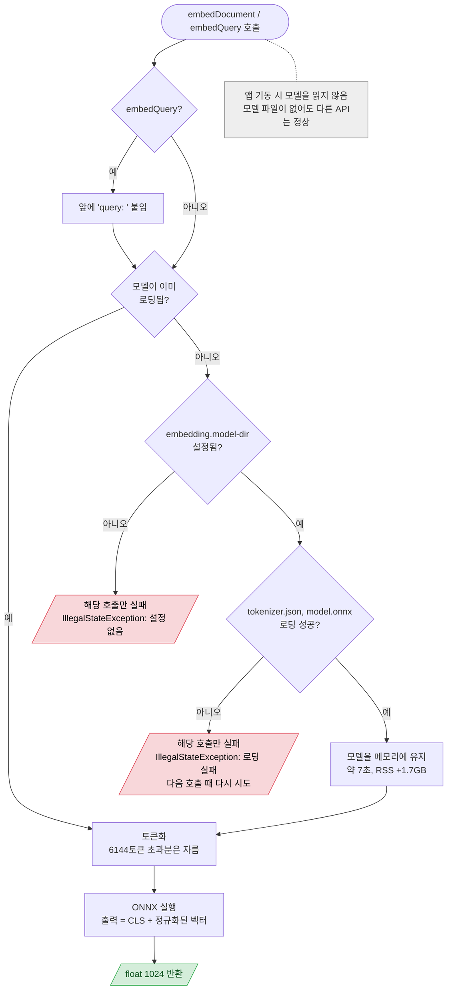

# 임베딩 (첫 호출 시 모델 로딩)

`EmbeddingClient.embedDocument / embedQuery` (API 아님, 아직 호출처 없음)

```mermaid
flowchart TD
    A([embedDocument / embedQuery 호출]) --> Q{embedQuery?}
    Q -- 예 --> P[앞에 'query: ' 붙임]
    Q -- 아니오 --> R
    P --> R{모델이 이미<br/>로딩됨?}
    R -- 예 --> T[토큰화<br/>6144토큰 초과분은 자름]
    R -- 아니오 --> S{embedding.model-dir<br/>설정됨?}
    S -- 아니오 --> RNOCFG[/해당 호출만 실패<br/>IllegalStateException: 설정 없음/]
    S -- 예 --> L{tokenizer.json, model.onnx<br/>로딩 성공?}
    L -- 아니오 --> RLOAD[/해당 호출만 실패<br/>IllegalStateException: 로딩 실패<br/>다음 호출 때 다시 시도/]
    L -- 예 --> KEEP[모델을 메모리에 유지<br/>약 7초, RSS +1.7GB]
    KEEP --> T
    T --> RUN[ONNX 실행<br/>출력 = CLS + 정규화된 벡터]
    RUN --> ROK[/float 1024 반환/]

    A -.- N1[앱 기동 시 모델을 읽지 않음<br/>모델 파일이 없어도 다른 API는 정상]

    classDef ok fill:#d4edda,stroke:#28a745,color:#155724
    classDef fail fill:#f8d7da,stroke:#dc3545,color:#000000
    classDef note fill:#eeeeee,stroke:#999999,color:#333333
    class ROK ok
    class RNOCFG,RLOAD fail
    class N1 note
```
