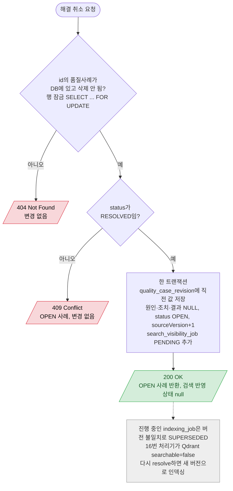

# QualityCase 해결 취소

`POST /api/quality-cases/{id}/reopen`

```mermaid
flowchart TD
    A([해결 취소 요청]) --> B{id의 품질사례가<br/>DB에 있고 삭제 안 됨?<br/>행 잠금 SELECT ... FOR UPDATE}
    B -- 아니오 --> R404[/404 Not Found<br/>변경 없음/]
    B -- 예 --> C{status가<br/>RESOLVED임?}
    C -- 아니오 --> R409[/409 Conflict<br/>OPEN 사례, 변경 없음/]
    C -- 예 --> D[한 트랜잭션<br/>quality_case_revision에 직전 값 저장<br/>원인·조치·결과 NULL, status OPEN, sourceVersion+1<br/>search_visibility_job PENDING 추가]
    D --> R200[/200 OK<br/>OPEN 사례 반환, 검색 반영 상태 null/]
    R200 -.-> N[진행 중인 indexing_job은 버전 불일치로 SUPERSEDED<br/>16번 처리기가 Qdrant searchable=false<br/>다시 resolve하면 새 버전으로 인덱싱]

    classDef ok fill:#d4edda,stroke:#28a745,color:#155724
    classDef fail fill:#f8d7da,stroke:#dc3545,color:#000000
    classDef note fill:#eeeeee,stroke:#999999,color:#333333
    class R200 ok
    class R404,R409 fail
    class N note
```
