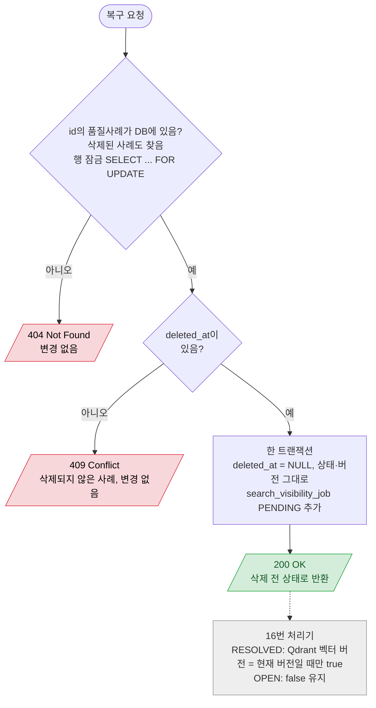

# QualityCase 삭제 복구

`POST /api/quality-cases/{id}/restore`

```mermaid
flowchart TD
    A([복구 요청]) --> B{id의 품질사례가 DB에 있음?<br/>삭제된 사례도 찾음<br/>행 잠금 SELECT ... FOR UPDATE}
    B -- 아니오 --> R404[/404 Not Found<br/>변경 없음/]
    B -- 예 --> C{deleted_at이<br/>있음?}
    C -- 아니오 --> R409[/409 Conflict<br/>삭제되지 않은 사례, 변경 없음/]
    C -- 예 --> D[한 트랜잭션<br/>deleted_at = NULL, 상태·버전 그대로<br/>search_visibility_job PENDING 추가]
    D --> R200[/200 OK<br/>삭제 전 상태로 반환/]
    R200 -.-> N[16번 처리기<br/>RESOLVED: Qdrant 벡터 버전 = 현재 버전일 때만 true<br/>OPEN: false 유지]

    classDef ok fill:#d4edda,stroke:#28a745,color:#155724
    classDef fail fill:#f8d7da,stroke:#dc3545,color:#000000
    classDef note fill:#eeeeee,stroke:#999999,color:#333333
    class R200 ok
    class R404,R409 fail
    class N note
```

- 복구는 삭제된 사례를 대상으로 하는 유일한 API다. 다른 API는 삭제된 사례에 404.
