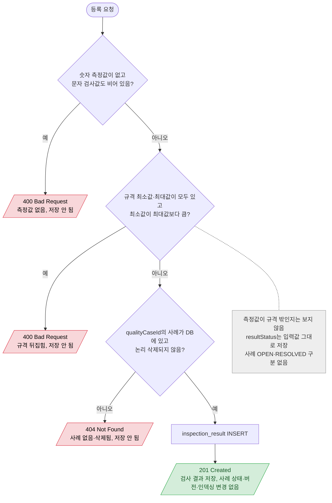

# InspectionResult 등록

`POST /api/quality-cases/{qualityCaseId}/inspection-results`

```mermaid
flowchart TD
    A([등록 요청]) --> B{숫자 측정값이 없고<br/>문자 검사값도 비어 있음?}
    B -- 예 --> R400A[/400 Bad Request<br/>측정값 없음, 저장 안 됨/]
    B -- 아니오 --> C{규격 최소값·최대값이 모두 있고<br/>최소값이 최대값보다 큼?}
    C -- 예 --> R400B[/400 Bad Request<br/>규격 뒤집힘, 저장 안 됨/]
    C -- 아니오 --> D{qualityCaseId의 사례가 DB에 있고<br/>논리 삭제되지 않음?}
    D -- 아니오 --> R404[/404 Not Found<br/>사례 없음·삭제됨, 저장 안 됨/]
    D -- 예 --> E[inspection_result INSERT]
    E --> R201[/201 Created<br/>검사 결과 저장, 사례 상태·버전·인덱싱 변경 없음/]

    C -.- N[측정값이 규격 밖인지는 보지 않음<br/>resultStatus는 입력값 그대로 저장<br/>사례 OPEN·RESOLVED 구분 없음]

    classDef ok fill:#d4edda,stroke:#28a745,color:#155724
    classDef fail fill:#f8d7da,stroke:#dc3545,color:#000000
    classDef note fill:#eeeeee,stroke:#999999,color:#333333
    class R201 ok
    class R400A,R400B,R404 fail
    class N note
```
