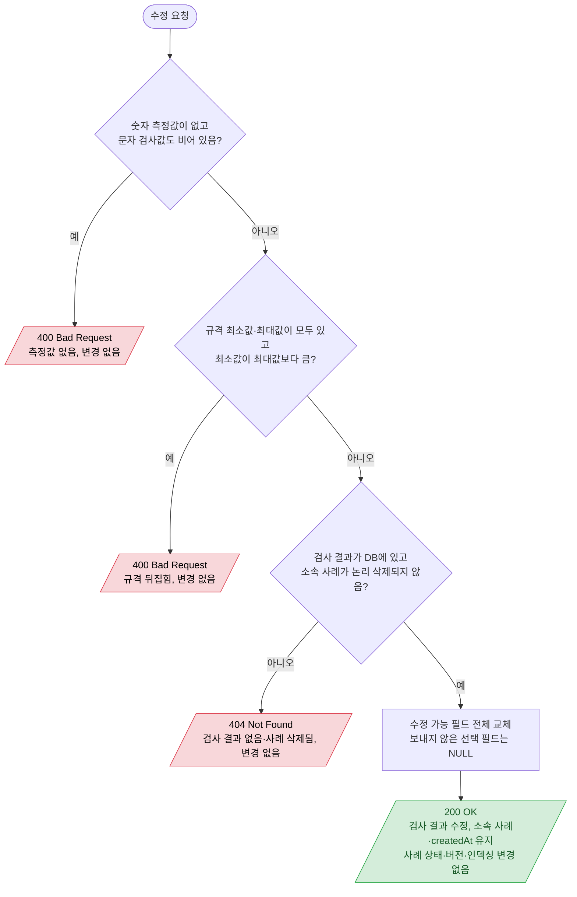

# InspectionResult 수정

`PUT /api/inspection-results/{id}`

```mermaid
flowchart TD
    A([수정 요청]) --> B{숫자 측정값이 없고<br/>문자 검사값도 비어 있음?}
    B -- 예 --> R400A[/400 Bad Request<br/>측정값 없음, 변경 없음/]
    B -- 아니오 --> C{규격 최소값·최대값이 모두 있고<br/>최소값이 최대값보다 큼?}
    C -- 예 --> R400B[/400 Bad Request<br/>규격 뒤집힘, 변경 없음/]
    C -- 아니오 --> D{검사 결과가 DB에 있고<br/>소속 사례가 논리 삭제되지 않음?}
    D -- 아니오 --> R404[/404 Not Found<br/>검사 결과 없음·사례 삭제됨, 변경 없음/]
    D -- 예 --> E[수정 가능 필드 전체 교체<br/>보내지 않은 선택 필드는 NULL]
    E --> R200[/200 OK<br/>검사 결과 수정, 소속 사례·createdAt 유지<br/>사례 상태·버전·인덱싱 변경 없음/]

    classDef ok fill:#d4edda,stroke:#28a745,color:#155724
    classDef fail fill:#f8d7da,stroke:#dc3545,color:#000000
    class R200 ok
    class R400A,R400B,R404 fail
```
