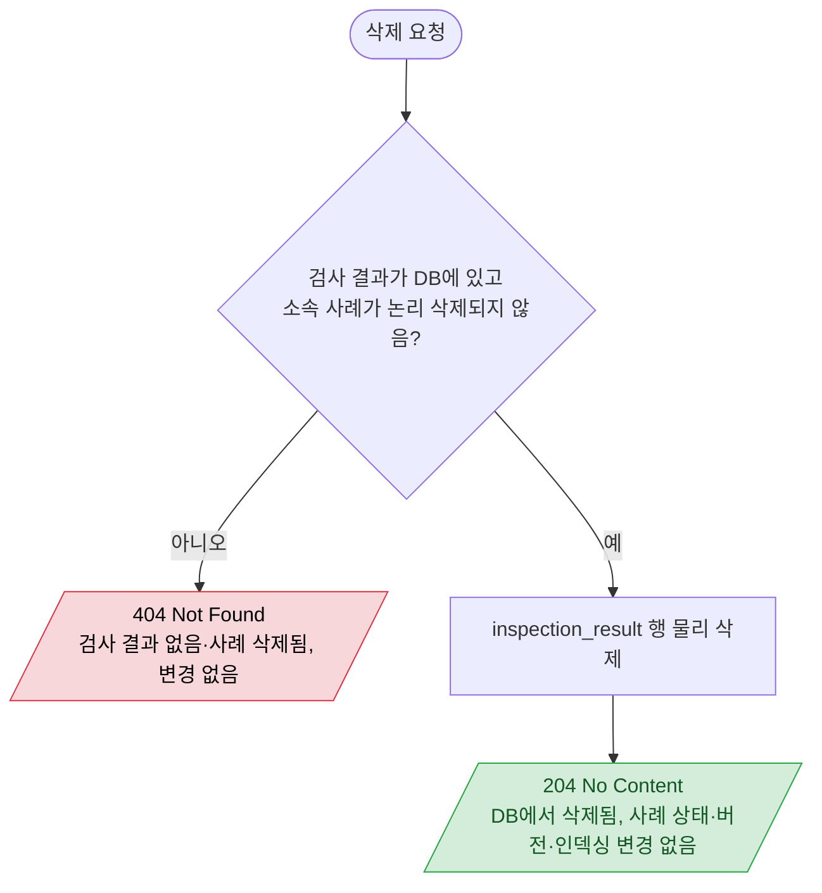

# InspectionResult 삭제

`DELETE /api/inspection-results/{id}`

```mermaid
flowchart TD
    A([삭제 요청]) --> B{검사 결과가 DB에 있고<br/>소속 사례가 논리 삭제되지 않음?}
    B -- 아니오 --> R404[/404 Not Found<br/>검사 결과 없음·사례 삭제됨, 변경 없음/]
    B -- 예 --> C[inspection_result 행 물리 삭제]
    C --> R204[/204 No Content<br/>DB에서 삭제됨, 사례 상태·버전·인덱싱 변경 없음/]

    classDef ok fill:#d4edda,stroke:#28a745,color:#155724
    classDef fail fill:#f8d7da,stroke:#dc3545,color:#000000
    class R204 ok
    class R404 fail
```
