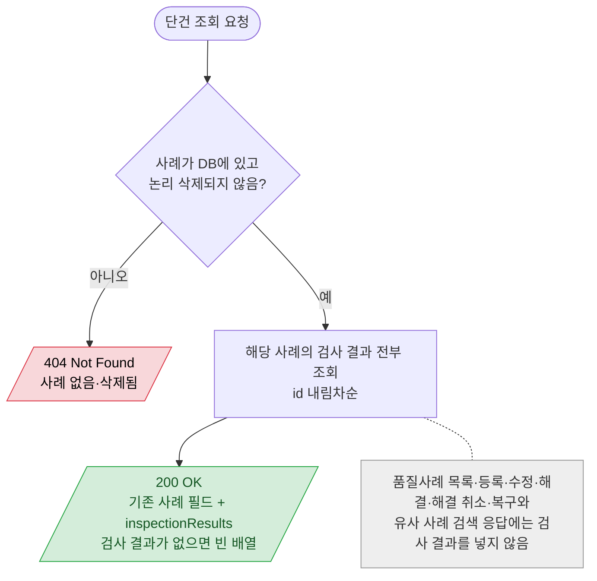

# QualityCase 단건 조회 (검사 결과 포함)

`GET /api/quality-cases/{id}`

```mermaid
flowchart TD
    A([단건 조회 요청]) --> B{사례가 DB에 있고<br/>논리 삭제되지 않음?}
    B -- 아니오 --> R404[/404 Not Found<br/>사례 없음·삭제됨/]
    B -- 예 --> C[해당 사례의 검사 결과 전부 조회<br/>id 내림차순]
    C --> R200[/200 OK<br/>기존 사례 필드 + inspectionResults<br/>검사 결과가 없으면 빈 배열/]

    C -.- N[품질사례 목록·등록·수정·해결·해결 취소·복구와<br/>유사 사례 검색 응답에는 검사 결과를 넣지 않음]

    classDef ok fill:#d4edda,stroke:#28a745,color:#155724
    classDef fail fill:#f8d7da,stroke:#dc3545,color:#000000
    classDef note fill:#eeeeee,stroke:#999999,color:#333333
    class R200 ok
    class R404 fail
    class N note
```
